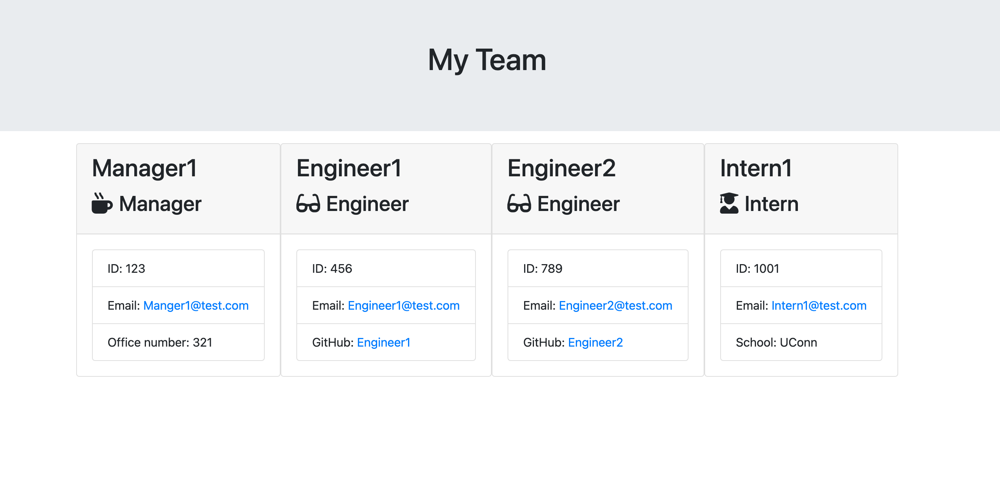

# A work in progress

---

# Team-Generator

---

## Description

Create a command line program that dynamically generates an team organization chart from user input.

---

## Table of Contents

    * Description
    * Installation
    * Site Structure
        - Develop direcotry
        - License information (MIT)
        - Site README.md
    * Usage
    * Contributing
    * Questions

---

## Installation

    1. Create this repostiory by using the GitHub forking process onto your computer.
    2. Install Node.js onto your computer.
    3. Install NPM the Node Project Manager onto your computer.

---

## Site Structure

1.  Develop directory

    - lib directory contains Employee class and htmlRenderer Javascript files
    - templates directory contains Employee html templates
    - test directory contains Javascript test files for the Employees
    - app.js Javascript file to start the program gathering the expected data and renders the html file
    - output directory contains the rendered html file

2.  License information (MIT)

3.  Images directory

    - Team.gif - photo of the rendered html team webpage

4.  Site README.md

---

## Usage

This program is designed to create a Team html webpage.

Start the program with the following command "npm run start".

---

## Contributing

GitHub Username - lucpizz

Please list your name here if you are contributing to this project.

---

## Questions

Please contact me at lucpizz@gmail.com for any questions regarding this program.

---

## Screen Shot of Team HTML Webpage

