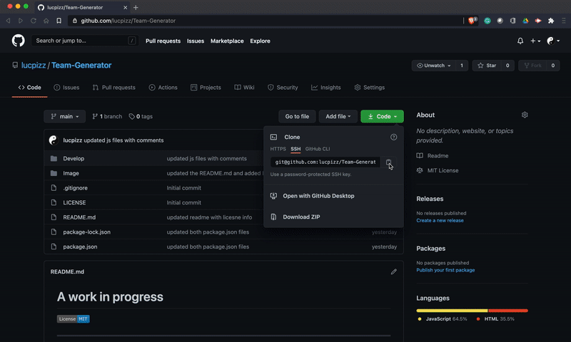

# A work in progress

---

# Team-Generator

---

## Description

Create a command line program that dynamically generates an team organization chart from user input.

---

## Table of Contents

    * Description
    * Installation
    * Site Structure
        - Develop direcotry
        - License information (MIT)
        - Site README.md
    * Usage
    * Contributing
    * Questions
    * GIF Video and Screen shot
    * License

---

## Installation

    1. Create this repostiory by using the GitHub forking process onto your computer.
    2. Navigator to the Develop directory.
    3. Install Node.js onto your computer.
    3. Install Inquirer.js onto your computer
    3. Install NPM the Node Project Manager onto your computer.

---

## Site Structure

1.  Develop directory

    - lib directory contains Employee class and htmlRenderer Javascript files
    - templates directory contains Employee html templates
    - test directory contains Javascript test files for the Employees
    - app.js Javascript file to start the program gathering the expected data and renders the html file
    - output directory contains the rendered html file

2.  License information (MIT)

3.  Images directory

    - Team-Generator.gif - video of the rendered html team webpage

4.  Site README.md

---

## Usage

This program is designed to create a Team html webpage.

Start the program with the following command "node app.js".

---

## Contributing

GitHub Username - lucpizz

Please list your name here if you are contributing to this project.

---

## Questions

Please contact me at lucpizz@gmail.com for any questions regarding this program.

---

## Video GIF of Team HTML Webpage

---

## License

MIT License

Copyright (c) 2021 Luca Pizzoferrato

Permission is hereby granted, free of charge, to any person obtaining a copy
of this software and associated documentation files (the "Software"), to deal
in the Software without restriction, including without limitation the rights
to use, copy, modify, merge, publish, distribute, sublicense, and/or sell
copies of the Software, and to permit persons to whom the Software is
furnished to do so, subject to the following conditions:

The above copyright notice and this permission notice shall be included in all
copies or substantial portions of the Software.

THE SOFTWARE IS PROVIDED "AS IS", WITHOUT WARRANTY OF ANY KIND, EXPRESS OR
IMPLIED, INCLUDING BUT NOT LIMITED TO THE WARRANTIES OF MERCHANTABILITY,
FITNESS FOR A PARTICULAR PURPOSE AND NONINFRINGEMENT. IN NO EVENT SHALL THE
AUTHORS OR COPYRIGHT HOLDERS BE LIABLE FOR ANY CLAIM, DAMAGES OR OTHER
LIABILITY, WHETHER IN AN ACTION OF CONTRACT, TORT OR OTHERWISE, ARISING FROM,
OUT OF OR IN CONNECTION WITH THE SOFTWARE OR THE USE OR OTHER DEALINGS IN THE
SOFTWARE.
